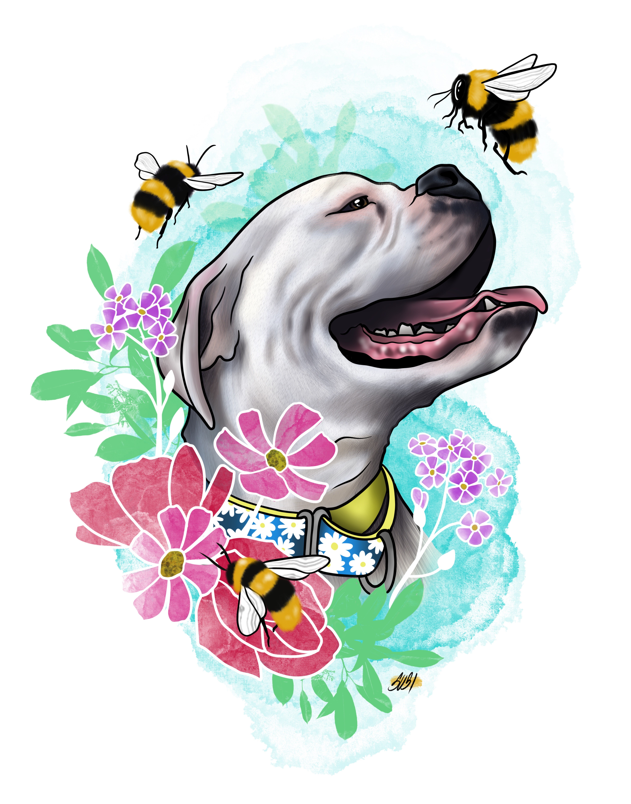

# **case_sstudy**

This repo is going to hold my first homework assignment.

#### Repor Directories

[superdupermodels](models)

[images](images)

Here is a great quoute about something!

> "To be is not to be."

---

In the models folder is where all of our code is gonna be.

Here is an example:

```python
print('This model rocks!')
```

## *This is my Beecatcher*




